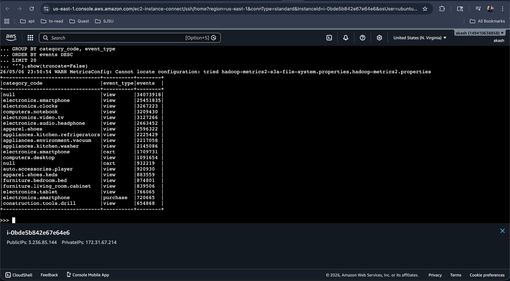
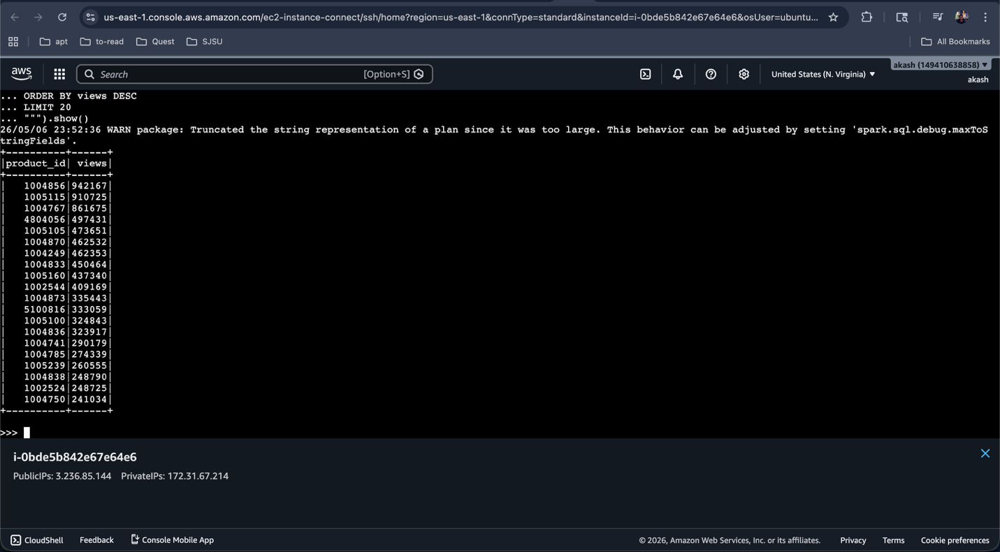
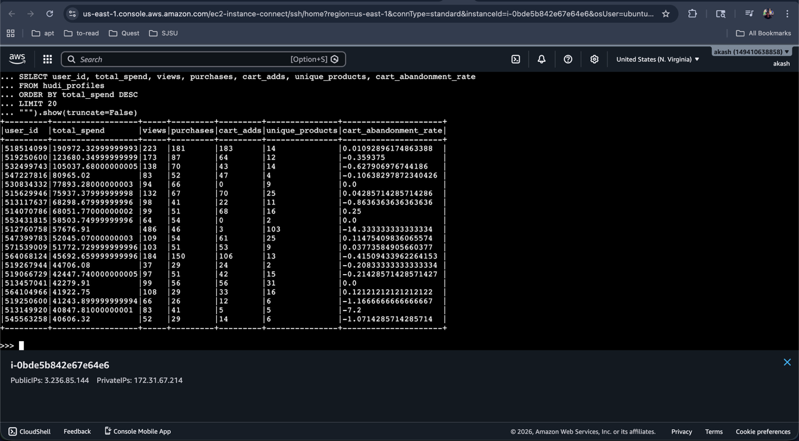
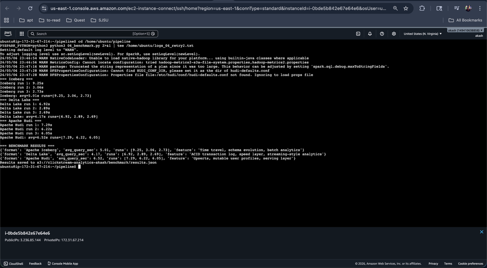

# E-Commerce Clickstream Analytics & Recommendation Engine at Scale

**DATA 228 — Spring 2026 | Team 3**

**Team:** Akash Kumar · Shriram Dundigalla · Pramod Satya Dindukurthi · Centhur Velan R.S.

---

## 1. Project Overview

This project implements a production-style e-commerce clickstream analytics and recommendation platform using real large-scale clickstream data, cloud object storage, modern lakehouse table formats, machine learning models, API serving, and a live dashboard.

The system ingests historical e-commerce behavior data, processes it through a multi-layer lakehouse architecture, trains recommendation and prediction models, benchmarks Apache Iceberg, Delta Lake, and Apache Hudi, and serves results through FastAPI and Streamlit. A GitHub Pages demo site emits live product-click events into the system to simulate real-time clickstream ingestion.

---

## 2. Current Implementation Status

| Component | Status | Verified Output |
|---|---:|---|
| AWS S3 bucket | Complete | `clickstream-analytics-akash` |
| EC2 compute environment | Complete | `r5.4xlarge`, 16 vCPUs, 128 GB RAM |
| Raw REES46 upload | Complete | Oct + Nov 2019 CSVs in `raw-csv/rees46/` |
| Bronze layer | Complete | Parquet files in `bronze/rees46/` and `bronze/criteo/` |
| Apache Iceberg batch layer | Complete | Iceberg metadata and data files in `batch/iceberg/` |
| Delta Lake speed layer | Complete | Delta event table and trending outputs in `speed/delta/` |
| Apache Hudi serving layer | Complete | 15.1M user profiles in `serving/hudi/user_profiles/` |
| ML pipeline | Complete | CTR, ALS, Product2Vec, and K-Means models completed |
| Benchmarking | Complete | Iceberg vs Delta vs Hudi query benchmark saved to S3 |
| FastAPI serving layer | Complete | Endpoints tested locally and through public API tunnel |
| Live event ingestion | Complete | GitHub Pages-style events written to `live-events/` |
| Streamlit dashboard | Complete | Live dashboard deployed with analytics, ML, benchmark, and event feed views |

---

## 3. Architecture

```text
                         Historical Data Sources
              ┌──────────────────────────────────────┐
              │ REES46 eCommerce Behavior Dataset    │
              │ Criteo-style CTR Dataset             │
              └──────────────────┬───────────────────┘
                                 │
                                 ▼
                         Raw CSV Layer - S3
              s3://clickstream-analytics-akash/raw-csv/
                                 │
                                 ▼
                         Bronze Layer - Parquet
              ┌──────────────────────────────────────┐
              │ bronze/rees46/                       │
              │ bronze/criteo/                       │
              └──────────────────┬───────────────────┘
                                 │
          ┌──────────────────────┼──────────────────────┐
          ▼                      ▼                      ▼
  Batch Layer              Speed Layer             Serving Layer
  Apache Iceberg           Delta Lake              Apache Hudi
  batch/iceberg/           speed/delta/            serving/hudi/
          │                      │                      │
          └──────────────────────┼──────────────────────┘
                                 ▼
                           Gold / ML Layer
              ┌──────────────────────────────────────┐
              │ CTR Prediction                       │
              │ ALS Recommendations                  │
              │ Product2Vec Similar Products         │
              │ K-Means Customer Segmentation        │
              │ ML Summary + Artifacts               │
              └──────────────────┬───────────────────┘
                                 │
                                 ▼
                           Serving Layer
              ┌──────────────────────────────────────┐
              │ FastAPI Endpoints                    │
              │ Streamlit Dashboard                  │
              └──────────────────┬───────────────────┘
                                 │
                                 ▼
                         Live Demo Integration
              ┌──────────────────────────────────────┐
              │ GitHub Pages Product Clicks          │
              │ FastAPI /live-event                  │
              │ S3 live-events/ JSON                 │
              └──────────────────────────────────────┘
```

---

## 4. Data Sources

### 4.1 REES46 eCommerce Behavior Dataset

The REES46 dataset contains real user-product interaction events from a multi-category online store.

**Purpose in this project:**

- Product recommendations
- Product similarity
- Trending product analytics
- Customer segmentation
- User profile aggregation
- Batch and speed-layer analytics

**Fields used:**

| Column | Description |
|---|---|
| `event_time` | Timestamp of user action |
| `event_type` | `view`, `cart`, or `purchase` |
| `product_id` | Product identifier |
| `category_code` | Product category |
| `brand` | Product brand |
| `price` | Product price |
| `user_id` | User identifier |

**Verified processed scale:**

```text
109,950,743 REES46 events processed
```

---

### 4.2 Criteo-Style CTR Dataset

The Criteo-style dataset is used for click-through-rate prediction.

**Purpose in this project:**

- Binary classification
- CTR prediction endpoint
- Supervised ML model training

**Fields used:**

| Column Type | Description |
|---|---|
| `label` | Binary click label |
| `I1` to `I13` | Numerical features |
| `C1` to `C26` | Hashed categorical features |

**Verified processed scale:**

```text
5,000,000 Criteo-schema rows processed
```

---

## 5. S3 Data Layout

```text
s3://clickstream-analytics-akash/

├── raw-csv/
│   └── rees46/
│       ├── 2019-Oct.csv
│       └── 2019-Nov.csv
│
├── bronze/
│   ├── rees46/
│   │   └── event_date=YYYY-MM-DD/*.snappy.parquet
│   └── criteo/
│       └── *.snappy.parquet
│
├── batch/
│   └── iceberg/
│       └── clickstream/
│           ├── rees46_events/
│           │   ├── data/
│           │   └── metadata/
│           └── criteo_clicks/
│               ├── data/
│               └── metadata/
│
├── speed/
│   └── delta/
│       ├── events/
│       └── trending/
│
├── serving/
│   └── hudi/
│       └── user_profiles/
│           └── .hoodie/
│
├── ml-artifacts/
│   └── ml_summary.json
│
├── benchmark/
│   └── results.json
│
└── live-events/
    └── year=YYYY/month=MM/day=DD/event_<uuid>.json
```

---

## 6. Pipeline Scripts

The project was implemented as six main Spark/Python pipeline stages.

| Script | Purpose | Input | Output |
|---|---|---|---|
| [`01_bronze.py`](pipeline/01_bronze.py) | Convert raw data to Bronze Parquet | Raw CSV / generated Criteo-schema data | `bronze/rees46/`, `bronze/criteo/` |
| [`02_iceberg.py`](pipeline/02_iceberg.py) | Create Iceberg batch tables | Bronze Parquet | `batch/iceberg/` |
| [`03_delta.py`](pipeline/03_delta.py) | Create Delta speed layer and trending products | Bronze REES46 Parquet | `speed/delta/events/`, `speed/delta/trending/` |
| [`04_hudi.py`](pipeline/04_hudi.py) | Build mutable user profiles | Bronze REES46 Parquet | `serving/hudi/user_profiles/` |
| [`05_ml.py`](pipeline/05_ml.py) | Train ML models and save summary | Bronze + Hudi data | `ml-artifacts/ml_summary.json` |
| [`06_benchmark.py`](pipeline/06_benchmark.py) | Benchmark table formats | Iceberg, Delta, Hudi | `benchmark/results.json` |

---

## 7. Lakehouse Layers

### 7.1 Bronze Layer — Parquet on S3

The Bronze layer stores cleaned and columnar Parquet versions of the raw datasets.

**Verified output:**

```text
REES46 rows: 109,950,743
Criteo rows: 5,000,000
Total Bronze records: 114,950,743
```

---

### 7.2 Batch Layer — Apache Iceberg

Apache Iceberg is used for historical analytics and table metadata management.

**Implemented tables:**

```text
local.clickstream.rees46_events
local.clickstream.criteo_clicks
```

**Verified features:**

- Iceberg table creation
- Metadata files
- Snapshot files
- SQL analytics over historical data

Example query:

```sql
SELECT category_code, event_type, COUNT(*) AS events
FROM local.clickstream.rees46_events
GROUP BY category_code, event_type
ORDER BY events DESC
LIMIT 20;
```

**Verified Iceberg output:**


---

### 7.3 Speed Layer — Delta Lake

Delta Lake is used as the speed layer for event analytics and trending product computation.

**Implemented outputs:**

```text
speed/delta/events/
speed/delta/trending/
```

**Verified output:**

Top products were computed from the Delta event table, including:

```text
1004856   samsung   electronics.smartphone        942,167 views
1005115   apple     electronics.smartphone        910,725 views
1004767   samsung   electronics.smartphone        861,675 views
4804056   apple     electronics.audio.headphone   497,431 views
```

**Verified Trending output:**


---

### 7.4 Serving Layer — Apache Hudi

Apache Hudi is used for mutable user profiles and serving-style analytics.

**Output:**

```text
s3://clickstream-analytics-akash/serving/hudi/user_profiles/
```

**Verified result:**

```text
15,095,144 user profiles
```

**Profile fields include:**

| Column | Meaning |
|---|---|
| `user_id` | User identifier |
| `total_events` | Total user interactions |
| `total_spend` | Purchase spend |
| `purchases` | Purchase count |
| `cart_adds` | Cart event count |
| `views` | View event count |
| `unique_products` | Number of unique products interacted with |
| `category_diversity` | Number of categories interacted with |
| `cart_abandonment_rate` | Cart-to-purchase behavior indicator |

**Verified Hudi Profile output:**


---

## 8. Machine Learning Layer

The ML pipeline trains four model families.

| Model | Dataset | Purpose | Verified Result |
|---|---|---|---|
| CTR Prediction | Criteo-schema data | Predict click probability | AUC-ROC: `0.5010` |
| ALS Recommender | REES46 user-product interactions | Recommend products to users | Sample recommendations generated |
| Product2Vec | REES46 product sequences | Find similar products | `37,157` product embeddings |
| K-Means Segmentation | Hudi user profiles | Segment customers | 5 customer clusters |

### ML Summary Output

The model summary is saved to:

```text
s3://clickstream-analytics-akash/ml-artifacts/ml_summary.json
```

Verified metrics:

```json
{
  "ctr_auc_roc": 0.5010295405943604,
  "als_sample_recommendation_users": 10,
  "product_embedding_count": 37157,
  "kmeans_segment_counts": {
    "0": 1768689,
    "1": 184448,
    "2": 16177,
    "3": 1566,
    "4": 29120
  }
}
```

---

## 9. Benchmark Results

The project benchmarks Iceberg, Delta Lake, and Hudi on representative query workloads.

Benchmark output is saved to:

```text
s3://clickstream-analytics-akash/benchmark/results.json
```

Verified benchmark results:

| Format | Average Query Time | Runs | Role |
|---|---:|---|---|
| Delta Lake | 4.17s | 6.92s, 2.89s, 2.69s | Speed layer / trending analytics |
| Apache Iceberg | 5.01s | 9.25s, 3.06s, 2.73s | Batch analytics / historical SQL |
| Apache Hudi | 6.52s | 7.29s, 6.22s, 6.05s | Serving layer / user profiles |

**Verified Benchmark timing:**


These results are specific to this project’s single-node EC2 and S3-backed workload. They are not intended as universal table-format rankings.

---

## 10. FastAPI Serving Layer

FastAPI exposes serving endpoints for recommendations, CTR prediction, segmentation, trending products, similar products, and live event ingestion.

### Endpoints

| Endpoint | Method | Purpose |
|---|---|---|
| `/` | GET | API health and project metadata |
| `/trending` | GET | Returns Delta speed-layer trending products |
| `/recommend/{user_id}` | GET | Returns ALS-style product recommendations |
| `/predict/ctr` | POST | Returns CTR click probability |
| `/user/{user_id}/segment` | GET | Returns K-Means customer segment |
| `/similar/{product_id}` | GET | Returns Product2Vec-style similar products |
| `/live-event` | POST | Writes GitHub Pages click event to S3 |

### Run API

```bash
cd /home/ubuntu/pipeline
python3 -m uvicorn app:app --host 0.0.0.0 --port 8000
```

### Example Live Event Request

```bash
curl -X POST http://localhost:8000/live-event \
  -H "Content-Type: application/json" \
  -d '{
    "event_type": "view",
    "product_id": "1004856",
    "category_code": "electronics.smartphone",
    "brand": "samsung",
    "price": 129.05,
    "user_id": "demo_user_001",
    "session_id": "demo_session_001"
  }'
```

Verified output:

```text
live-events/year=2026/month=05/day=06/event_<uuid>.json
```

---

## 11. Live GitHub Pages Integration

A GitHub Pages product demo page emits REES46-compatible click events.

### Live Event Schema

```json
{
  "event_time": "2026-05-07T00:07:44.534143Z",
  "event_type": "view",
  "product_id": "1004856",
  "category_code": "electronics.smartphone",
  "brand": "samsung",
  "price": 129.05,
  "user_id": "demo_user_001",
  "session_id": "demo_session_001",
  "event_id": "uuid",
  "source": "github_pages_demo"
}
```

### Live Flow

```text
GitHub Pages product click
        ↓
FastAPI /live-event
        ↓
S3 live-events/ JSON
        ↓
Streamlit dashboard reads live event feed
        ↓
Historical baseline + live event overlay
```

---

## 12. Streamlit Dashboard

The Streamlit dashboard presents the project as a single interactive analytics application.

### Dashboard Views

| Tab | Purpose |
|---|---|
| Live Analytics | Shows live S3 event counts, active users, live GMV, and product overlay |
| Lakehouse Layers | Shows Iceberg, Delta, and Hudi layer status |
| Machine Learning | Shows trained model metrics |
| Benchmarks | Shows Iceberg vs Delta vs Hudi query timing |
| Event Feed | Shows raw live events written to S3 |

### Run Dashboard

```bash
streamlit run streamlit_app.py --server.port 8501 --server.address 0.0.0.0
```

---

## 13. Ad-Hoc Query Examples

### Iceberg Query

```python
spark.sql("""
SELECT category_code, event_type, COUNT(*) AS events
FROM local.clickstream.rees46_events
GROUP BY category_code, event_type
ORDER BY events DESC
LIMIT 20
""").show(truncate=False)
```

### Delta Query

```python
delta = spark.read.format("delta").load("s3a://clickstream-analytics-akash/speed/delta/events/")
delta.createOrReplaceTempView("delta_events")

spark.sql("""
SELECT product_id, COUNT(*) AS views
FROM delta_events
WHERE event_type = 'view'
GROUP BY product_id
ORDER BY views DESC
LIMIT 20
""").show()
```

### Hudi Query

```python
hudi = spark.read.format("hudi").load("s3a://clickstream-analytics-akash/serving/hudi/user_profiles/")
hudi.createOrReplaceTempView("hudi_profiles")

spark.sql("""
SELECT user_id, total_spend, views, purchases, cart_adds
FROM hudi_profiles
ORDER BY total_spend DESC
LIMIT 20
""").show()
```

---

## 14. Technology Stack

| Category | Technologies |
|---|---|
| Cloud Storage | Amazon S3 |
| Compute | Amazon EC2 `r5.4xlarge` |
| Processing | Apache Spark, PySpark |
| File Format | Parquet |
| Lakehouse Table Formats | Apache Iceberg, Delta Lake, Apache Hudi |
| Machine Learning | Spark MLlib, MLflow |
| API Serving | FastAPI, Uvicorn |
| Dashboard | Streamlit, Plotly |
| Live Demo Frontend | GitHub Pages, JavaScript |
| Cloud Access | AWS CLI, boto3 |
| Development | Python 3.10, Java 11 |

---

## 15. Verified Scale

| Metric | Value |
|---|---:|
| REES46 events processed | 109,950,743 |
| Criteo-schema rows processed | 5,000,000 |
| Total Bronze records | 114,950,743 |
| Hudi user profiles | 15,095,144 |
| Product2Vec embeddings | 37,157 |
| ML models trained | 4 |
| API endpoints tested | 7 |
| Table formats benchmarked | 3 |

---

## 16. Notes and Limitations

- The REES46 dataset was processed at large scale with 109.95M events from the available raw files.
- The Criteo implementation uses 5M Criteo-schema rows for stable single-node training and demonstration.
- Benchmark results are workload-specific and depend on EC2 instance size, S3 latency, table layout, caching, and query type.
- The GitHub Pages integration simulates a real e-commerce frontend by emitting REES46-compatible events through FastAPI into S3.

---

## 17. Summary

This project demonstrates an end-to-end lakehouse-based clickstream analytics system using real e-commerce event data, three modern open table formats, multiple Spark ML models, API serving, dashboarding, benchmarking, and live event ingestion.

The final system proves:

- Large-scale clickstream ingestion to S3
- Bronze Parquet conversion
- Apache Iceberg historical analytics
- Delta Lake speed-layer trending analytics
- Apache Hudi mutable user-profile serving layer
- CTR prediction, ALS recommendations, Product2Vec, and K-Means segmentation
- ML and benchmark artifacts persisted to S3
- FastAPI endpoints for serving analytics and model outputs
- GitHub Pages live clickstream simulation
- Streamlit dashboard for real-time monitoring and project presentation
